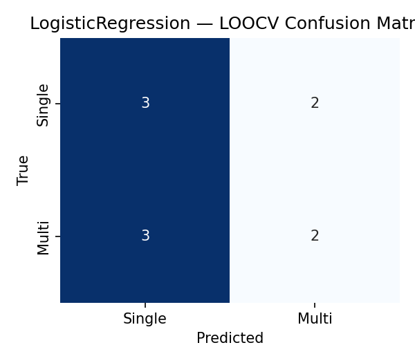
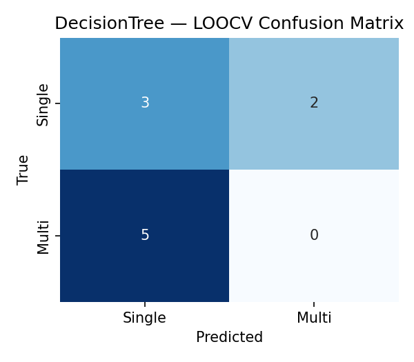
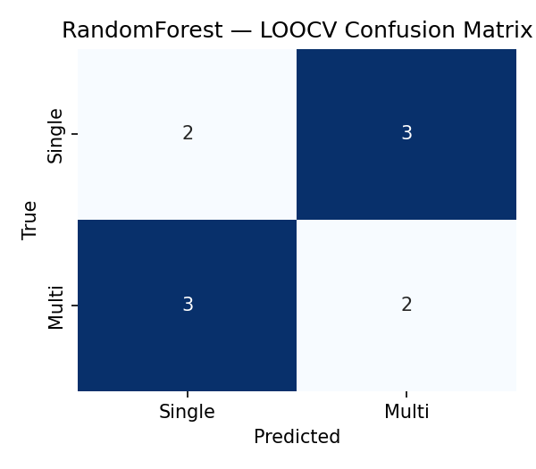
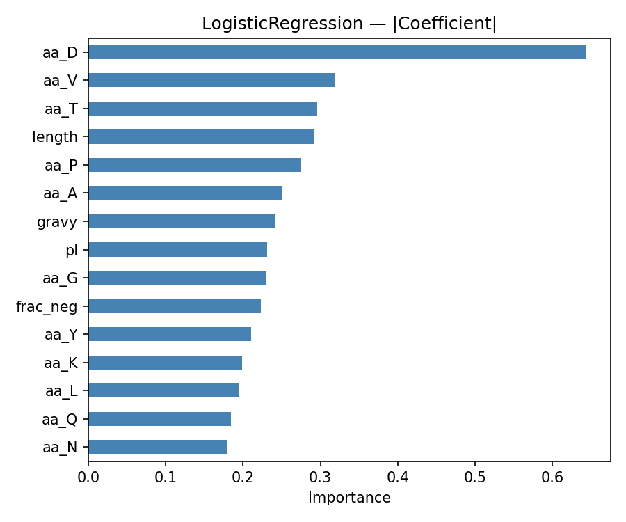
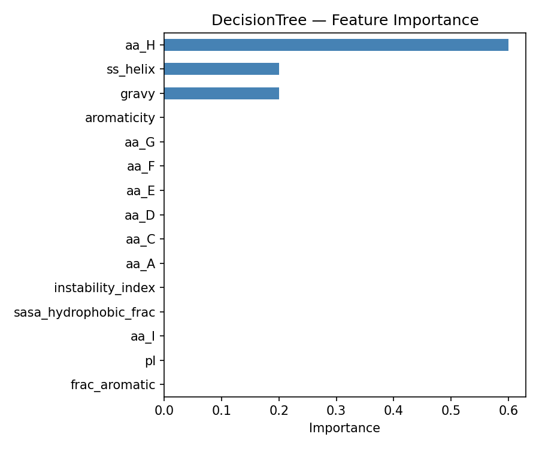
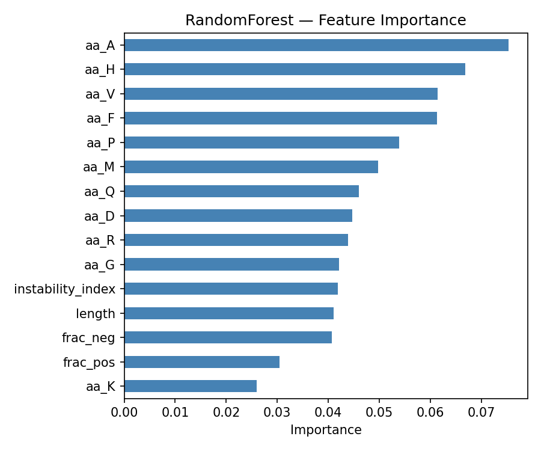
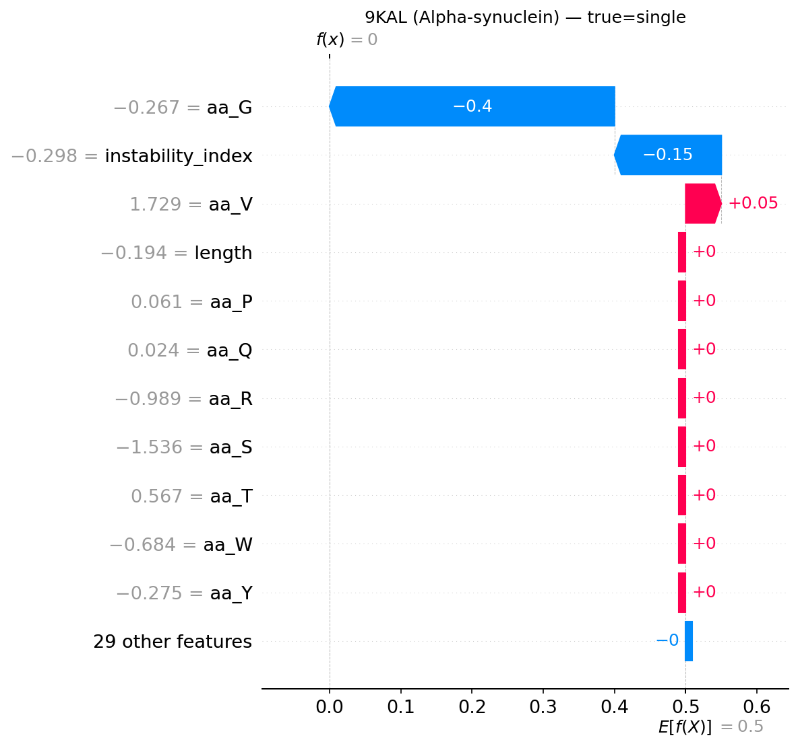
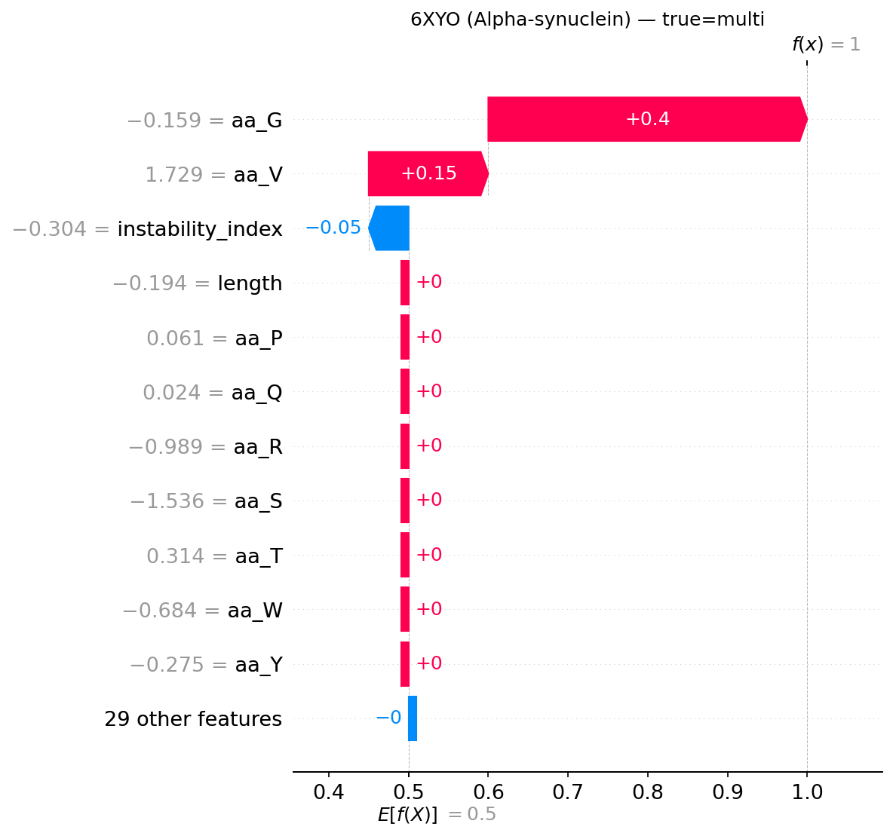

# Amyloid Fibril Morphology Predictor — Results Report

    *Auto-generated 2026-05-13 11:01*

    ## 1. Dataset

    - **N samples:** 10
    - **Class balance:** {0: np.int64(5), 1: np.int64(5)}
    - **Feature matrix:** `data/processed/features.csv` (54 columns)
    - **Dropped due to Step-2 extraction limits:** `plddt_mean`, `plddt_median`,
    `frac_disordered` (AF v6 mmCIF format change — pLDDT lives in a separate
    metric block).

    ## 2. Validation Scheme

    - **Leave-One-Out Cross-Validation (LOOCV)** — 10 folds, deterministic, no
    random seed bias. Selected because n=10 makes k-fold splits highly
    sensitive to test-set composition (the deep-research report flags
    *"data scarcity"* and *"overfitting"* as primary risks; LOOCV is the
    canonical mitigation for both).

    ## 3. LOOCV Metrics

    | model              |   accuracy |    f1 |   roc_auc |
|:-------------------|-----------:|------:|----------:|
| Majority           |      0.500 | 0.000 |     0.500 |
| LogisticRegression |      0.500 | 0.444 |     0.640 |
| RandomForest       |      0.400 | 0.400 |     0.320 |
| DecisionTree       |      0.300 | 0.000 |     0.300 |

    **Best model: `Majority`** (Accuracy = 0.500,
    F1 = 0.000, ROC-AUC = 0.500).

    ### Per-model accuracy
    | model              |   accuracy |
|:-------------------|-----------:|
| DecisionTree       |      0.300 |
| LogisticRegression |      0.500 |
| Majority           |      0.500 |
| RandomForest       |      0.400 |

    ## 4. Misclassified Examples (Student A — biological review)

    | model              | pdb_id   |   y_true |   y_pred |   proba_multi |   correct |
|:-------------------|:---------|---------:|---------:|--------------:|----------:|
| DecisionTree       | 2M4J     |        1 |        0 |         0.000 |         0 |
| DecisionTree       | 2NAO     |        1 |        0 |         0.000 |         0 |
| DecisionTree       | 5O3L     |        1 |        0 |         0.000 |         0 |
| DecisionTree       | 6GK3     |        1 |        0 |         0.000 |         0 |
| DecisionTree       | 6W06     |        0 |        1 |         1.000 |         0 |
| DecisionTree       | 6XYO     |        1 |        0 |         0.000 |         0 |
| DecisionTree       | 7P0V     |        0 |        1 |         1.000 |         0 |
| LogisticRegression | 5O3L     |        1 |        0 |         0.169 |         0 |
| LogisticRegression | 6GK3     |        1 |        0 |         0.425 |         0 |
| LogisticRegression | 6XYO     |        1 |        0 |         0.071 |         0 |
| LogisticRegression | 7P0V     |        0 |        1 |         0.703 |         0 |
| LogisticRegression | 7Q4B     |        0 |        1 |         0.955 |         0 |
| Majority           | 2M4J     |        1 |        0 |         0.000 |         0 |
| Majority           | 2NAO     |        1 |        0 |         0.000 |         0 |
| Majority           | 5O3L     |        1 |        0 |         0.000 |         0 |
| Majority           | 6GK3     |        1 |        0 |         0.000 |         0 |
| Majority           | 6XYO     |        1 |        0 |         0.000 |         0 |
| RandomForest       | 5O3L     |        1 |        0 |         0.294 |         0 |
| RandomForest       | 6GK3     |        1 |        0 |         0.458 |         0 |
| RandomForest       | 6W06     |        0 |        1 |         0.581 |         0 |
| RandomForest       | 6XYO     |        1 |        0 |         0.423 |         0 |
| RandomForest       | 7P0V     |        0 |        1 |         0.577 |         0 |
| RandomForest       | 7Q4B     |        0 |        1 |         0.547 |         0 |

    > Action for **Student A**: examine the structural details of the misses
    > above. Are they "twisted vs. flat" doublets? Brain-derived vs. in vitro?
    > These outliers are the most informative entries for biological discussion.

    ## 5. Figures

    ### Confusion matrices
    
    
    

    ### Feature importance / coefficients
    
    
    

    ### SHAP — global
    
    

    ### SHAP — per-sample (Student A interpretation targets)
    
    

    ## 6. Interpretation Notes (template for Student A)

    - The **top-ranked features** in §5 are the biological drivers of fibril
    morphology in this dataset. Cross-reference each against the deep-research
    report (§5 Feature Sets) — features like `frac_hydrophobic`, `gravy`,
    `ss_sheet`, and `sasa_hydrophobic_frac` map directly to the steric-zipper
    / lateral-association literature (Iadanza et al., 2018).
    - The **SHAP force plots** show *why* a specific protein was classified
    Single vs. Multi. Use these in the report's Discussion section to argue
    beyond accuracy numbers.
    - All structural features are **identical within UniProt groups** (the four
    APP entries share Rg, SS%, SASA). Discriminative power therefore comes
    from sequence features (chain-specific FASTA) interacting with structural
    context — a known limitation noted in §7 (Risks & Mitigations) of the
    deep-research report.

    ## 7. Reproducibility

    ```bash
    pip install -r requirements.txt
    python -m src.fetch_data           # Step 1
    python -m src.build_features       # Step 2
    python -m src.train_model          # Step 3a (this report)
    python -m src.explain_model        # Step 3b
    python -m src.generate_report      # Step 3c

    