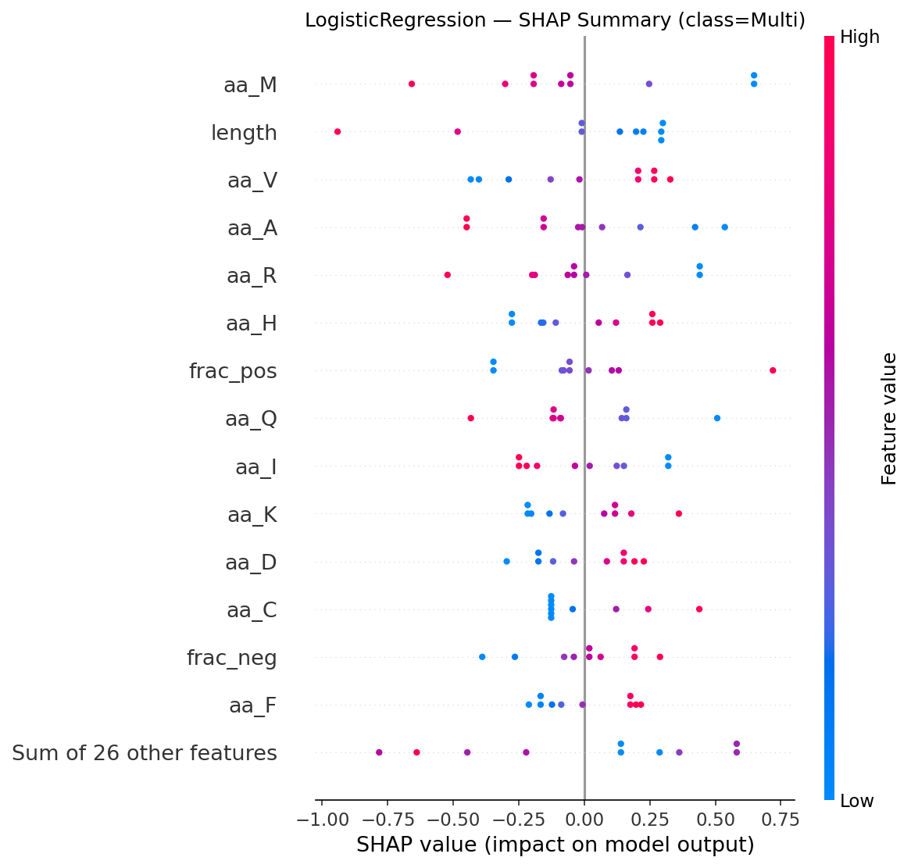
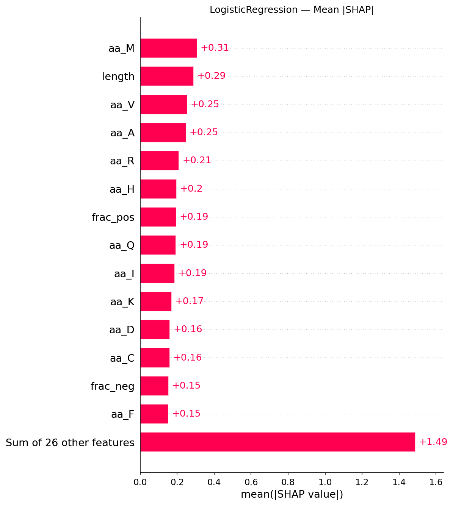

# Amyloid Fibril Morphology Predictor — Results Report

*Auto-generated 2026-05-13 21:16*

## 1. Dataset

- **N samples:** 10
- **Class balance:** {0: np.int64(5), 1: np.int64(5)}
- **Feature matrix:** `data/processed/features.csv` (54 columns)
- **Dropped due to Step-2 extraction limits:** `plddt_mean`, `plddt_median`,
`frac_disordered` (AF v6 mmCIF format change — pLDDT lives in a separate
metric block).

## 2. Validation Scheme

- **Leave-One-Out Cross-Validation (LOOCV)** — 10 folds, deterministic, no
random seed bias. Selected because n=10 makes k-fold splits highly
sensitive to test-set composition (the deep-research report flags
*"data scarcity"* and *"overfitting"* as primary risks; LOOCV is the
canonical mitigation for both).

## 3. LOOCV Metrics

| model              |   accuracy |    f1 |   roc_auc |
|:-------------------|-----------:|------:|----------:|
| LogisticRegression |      0.600 | 0.500 |     0.620 |
| Majority           |      0.500 | 0.000 |     0.500 |
| DecisionTree       |      0.500 | 0.545 |     0.500 |
| RandomForest       |      0.500 | 0.444 |     0.540 |

**Best model: `LogisticRegression`** (Accuracy = 0.600,
F1 = 0.500, ROC-AUC = 0.620).

### Per-model accuracy
| model              |   accuracy |
|:-------------------|-----------:|
| DecisionTree       |      0.500 |
| LogisticRegression |      0.600 |
| Majority           |      0.500 |
| RandomForest       |      0.500 |

## 4. Misclassified Examples (Student A — biological review)

| model              | pdb_id   |   y_true |   y_pred |   proba_multi |   correct |
|:-------------------|:---------|---------:|---------:|--------------:|----------:|
| DecisionTree       | 5O3L     |        1 |        0 |         0.000 |         0 |
| DecisionTree       | 7LNA     |        0 |        1 |         1.000 |         0 |
| DecisionTree       | 9GKF     |        0 |        1 |         1.000 |         0 |
| DecisionTree       | 9JHG     |        1 |        0 |         0.000 |         0 |
| DecisionTree       | 9KAL     |        0 |        1 |         1.000 |         0 |
| LogisticRegression | 5O3L     |        1 |        0 |         0.449 |         0 |
| LogisticRegression | 6XYO     |        1 |        0 |         0.020 |         0 |
| LogisticRegression | 7LNA     |        0 |        1 |         0.879 |         0 |
| LogisticRegression | 7ZJ2     |        1 |        0 |         0.297 |         0 |
| Majority           | 5O3L     |        1 |        0 |         0.000 |         0 |
| Majority           | 6XYO     |        1 |        0 |         0.000 |         0 |
| Majority           | 7YAT     |        1 |        0 |         0.000 |         0 |
| Majority           | 7ZJ2     |        1 |        0 |         0.000 |         0 |
| Majority           | 9JHG     |        1 |        0 |         0.000 |         0 |
| RandomForest       | 5O3L     |        1 |        0 |         0.427 |         0 |
| RandomForest       | 6XYO     |        1 |        0 |         0.392 |         0 |
| RandomForest       | 7LNA     |        0 |        1 |         0.513 |         0 |
| RandomForest       | 9GKF     |        0 |        1 |         0.530 |         0 |
| RandomForest       | 9JHG     |        1 |        0 |         0.450 |         0 |

> TODO: examine the structural details of the misses
> above. Are they "twisted vs. flat" doublets? Brain-derived vs. in vitro?
> These outliers are the most informative entries for biological discussion.

## 5. Figures

### Confusion matrices


### Feature importance / coefficients


### SHAP — global



### SHAP — per-sample (Student A interpretation targets)


## 6. Interpretation Notes (template for Student A)

- The **top-ranked features** in §5 are the biological drivers of fibril
morphology in this dataset. Cross-reference each against the deep-research
report (§5 Feature Sets) — features like `frac_hydrophobic`, `gravy`,
`ss_sheet`, and `sasa_hydrophobic_frac` map directly to the steric-zipper
/ lateral-association literature (Iadanza et al., 2018).
- The **SHAP force plots** show *why* a specific protein was classified
Single vs. Multi. Use these in the report's Discussion section to argue
beyond accuracy numbers.
- All structural features are **identical within UniProt groups** (the four
APP entries share Rg, SS%, SASA). Discriminative power therefore comes
from sequence features (chain-specific FASTA) interacting with structural
context — a known limitation noted in §7 (Risks & Mitigations) of the
deep-research report.

## 7. Reproducibility

```bash
pip install -r requirements.txt
python -m src.fetch_data           # Step 1
python -m src.build_features       # Step 2
python -m src.train_model          # Step 3a (this report)
python -m src.explain_model        # Step 3b
python -m src.generate_report      # Step 3c
